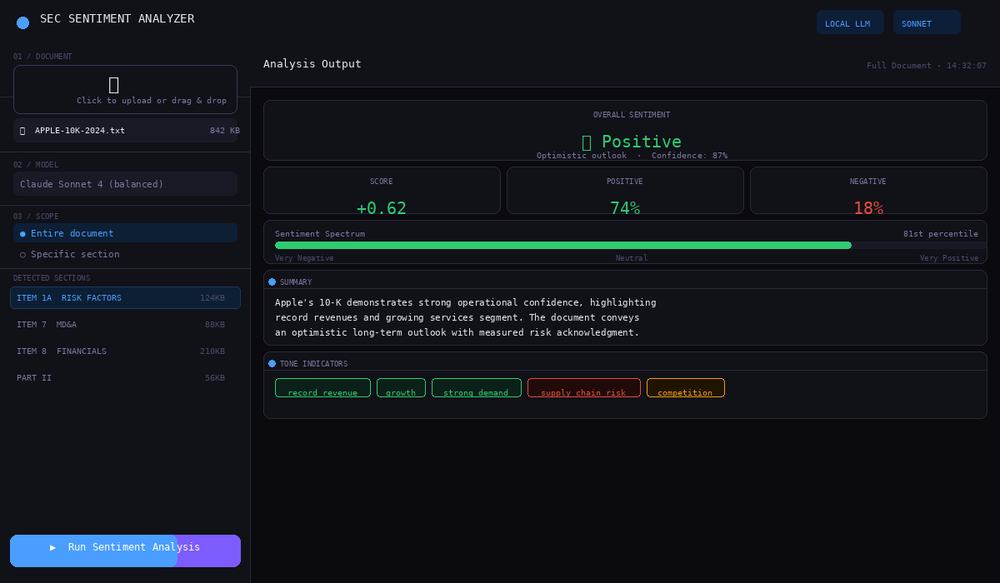

# 📊 SEC Sentiment Analyzer

### 🔗 [▶ ABRIR APP](https://katorres0406.github.io/sec-sentiment-analyzer/index-2.html)

> **https://katorres0406.github.io/sec-sentiment-analyzer/index-2.html**

---

## Screenshot



---

## ¿Qué hace?

App web que analiza el sentimiento de documentos de la SEC (10-K, 10-Q, 8-K, etc.) directamente en el navegador — sin servidor, sin API keys, sin instalación.

- 📄 Sube cualquier filing de la SEC (TXT, HTML, XML)
- 🔍 Detecta secciones automáticamente (ITEM 1A, PART II, MD&A, etc.)
- 🎯 Analiza el documento completo o una sección específica
- 📈 Genera score de sentimiento (-1.0 a +1.0), porcentajes positivo/negativo, keywords y señales de riesgo
- 🌙 Corre 100% local en el navegador

---

## Cómo usarla

1. Abre la app en el link de arriba
2. Sube un archivo de la SEC
3. Elige si analizar el documento completo o una sección
4. Haz clic en **Run Sentiment Analysis**
5. Lee los resultados

---

## Tecnología

El análisis usa el **lexicón Loughran-McDonald**, el estándar académico para análisis de sentimiento en documentos financieros. Más de 100 palabras positivas y negativas específicas del lenguaje financiero-regulatorio, más detección de frases de riesgo como `market risk`, `going concern`, `material weakness`.

Todo corre en JavaScript puro en el navegador — sin backend, sin dependencias.

---

## Estructura del proyecto

```
sec-sentiment-analyzer/
├── index-2.html        ← app completa
├── screenshots/
│   └── app-screenshot.png
└── README.md
```

---

## Disclaimer

Los resultados son generados por un algoritmo de análisis de texto y son para fines educativos únicamente — no constituyen asesoría financiera.

---

## Licencia

MIT
